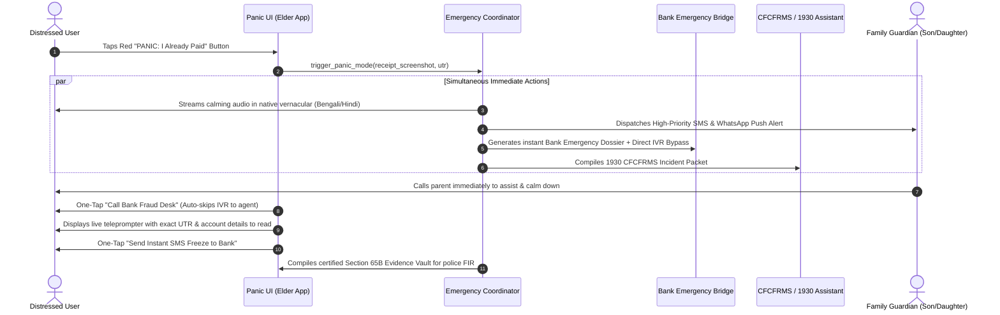
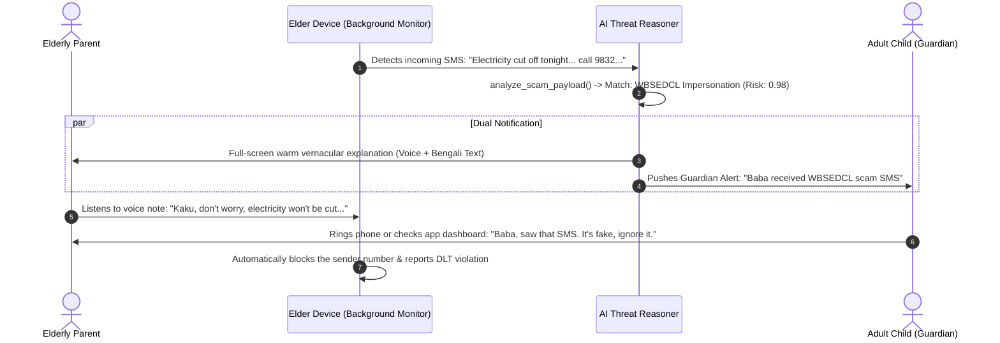

# 🛡️ AI Scam Shield for India & Nyaya Sahayak (Consumer Rights Agent)
## Comprehensive System Architecture, Functional Specifications & Strategic Blueprint

---

## 1. Executive Summary & Core Strategic Pivot

### 1.1 The Market Fallacy vs. The Unfilled Reality
Most existing cybersecurity and anti-fraud mobile applications in India fail because of two fatal assumptions:
1. **The Pre-Detection Delusion:** They assume the user knows when to seek help *before* getting deceived. In reality, modern social engineering (Digital Arrests, FedEx narcotics scams, electricity disconnection intimidation, deepfake family voices) induces high cortisol and cognitive blindness. The victim believes the scam is authentic until the balance drops to zero.
2. **The Wrong Target Audience:** Existing apps target the elderly directly. Elderly and non-tech-savvy users almost never discover, install, configure, or trust third-party cybersecurity apps.

### 1.2 The Core Value Proposition: The Two Asymmetric Moats
This platform is engineered around two high-conviction insights:
* **The "First 5 Minutes of a Fire" Panic Protocol (Post-Scam Golden Hour):** Everyone sells smoke alarms; nobody helps when the room is on fire. The moment money leaves an account is when a victim is in peak desperation, paralyzed by shame and panic. By providing an instant, 1-click **Golden Hour Emergency Response System** (auto-freezing accounts, generating CFCFRMS / 1930 Cyber Fraud dossiers, initiating NPCI UPI recall tickets, and preserving evidence), the system captures the user at their highest willingness-to-trust moment.
* **The Family Guardian Model ("Son/Daughter Protects Parents"):** Instead of asking elderly parents to buy safety software, the product is sold to the 22–45 tech-literate adult child ("Set up your parents' phone in 2 minutes, get silent alerts when high-risk transactions or extortion texts strike, and step in before or immediately after catastrophe happens").
* **Hyper-Local Vernacular Persona ("The Empathetic Local Relative"):** Explanations are delivered not in cold robotic English ("High risk score: 0.89"), but in the colloquial tone of a knowledgeable, protective local relative (Hindi, Bengali, Marathi, Tamil, Telugu, Kannada, Hinglish/Banglish), referencing hyper-local real-world context (e.g., WBSEDCL, BESCOM, Mahavitaran power cut SMS scams, local police dispatch summons, fake India Post tracking links).
* **Nyaya Sahayak (The Citizen Legal Shield):** Beyond fraud, everyday Indian consumers lose billions to corporate bad faith (e.g., e-commerce return rejections, hidden hotel cancellation fees, airline voucher tricks, denied warranty claims). Nyaya Sahayak is an autonomous consumer advocate that ingests bills, chats, and rejection letters, cross-references the Consumer Protection Act (CPA) 2019, and generates legal notices, NCH (National Consumer Helpline) dossiers, and e-Daakhil court filings.

---

## 2. High-Level System Architecture

```mermaid
flowchart TD
    subgraph INGESTION["1. Omnichannel Ingestion Layer"]
        A1[SMS & WhatsApp Interceptor]
        A2[Payment / UPI Intent & QR Hook]
        A3[System Screenshot / Media Locker]
        A4[Phone Number / Caller ID Probe]
        A5[Document Ingestion: Bills, Invoices, T&Cs]
    end

    subgraph CLIENT["2. Client Interfaces"]
        C1[Protected User App / Elder Mode]
        C2[Guardian Dashboard App]
        C3[WhatsApp Bot & Web Assist]
        C4[Emergency 'I Already Paid' Panic Trigger]
    end

    subgraph SECURE_GATEWAY["3. Edge Privacy & Sanitization Gateway"]
        E1[Local On-Device PII Masking]
        E2[Zero-Knowledge Media Redactor]
        E3[Cryptographic Hash & Chain of Custody Stamp]
    end

    subgraph CORE_AI["4. Multi-Agent AI & Forensic Intelligence Core"]
        M1[Triage & Sentiment Dissector]
        M2[Indian Threat Knowledge Graph<br/>(DLT, 1930 vectors, NPCI VPAs)]
        M3[Vernacular Relative Tone Synthesizer]
        M4[Nyaya Legal Reasoner<br/>(CPA 2019, RBI Ombudsman, e-Daakhil)]
        M5[Forensic Evidence Bundler]
    end

    subgraph ACTION_ENGINES["5. Autonomous Action & Escalation Engines"]
        P1[Emergency Golden Hour Protocol<br/>(Bank Freeze, 1930 Packet, NPCI Recall)]
        P2[Guardian Push & Remote Assist Relay]
        P3[Official Grievance Auto-Filer<br/>(NCH, INGRAM, Legal Notices)]
    end

    A1 & A2 & A3 & A4 & A5 --> E1 & E2
    E1 & E2 --> E3 --> CORE_AI
    C1 & C4 --> P1
    CORE_AI --> M3 --> C1
    CORE_AI --> M2 & M5 --> P1
    P1 --> P2 --> C2
    CORE_AI --> M4 --> P3
```

---

## 3. Subsystem Breakdown & Functional Specifications

### 3.1 Subsystem 1: "Panic Mode" (The Golden Hour Financial Emergency First Responder)

When a victim realizes they have transferred money to a fraudster, the first 60 minutes determine whether the money can be frozen in transit or whether it is laundered through mule accounts. Panic Mode orchestrates instant defensive triage.

#### Function 1.1: `trigger_panic_mode(incident_payload)`
* **Description:** Entry point activated by a prominent, single-tap red button: *"I Already Paid / Emergency"* or voice command *"Mera paisa kat gaya"*.
* **Inputs:**
  * `victim_id`: UUID of the authenticated user.
  * `channel_type`: `UPI` | `NET_BANKING` | `DEBIT_CREDIT_CARD` | `ATM_CASH` | `REMOTE_DESKTOP_ACCESS` (e.g., AnyDesk/TeamViewer).
  * `raw_evidence`: Screenshot of payment receipt, SMS debit alert, transaction reference number (UTR / UPI Ref ID), or audio confession.
  * `estimated_timestamp`: Timestamp when transaction occurred.
* **Internal Workflow:**
  1. Activates immediate local audio guidance in chosen vernacular: *"Shanto hon, panic korben na. Amra apnar shathe aachi. Prothome bank account freeze korbo."* (Stay calm, don't panic. We are with you. First, we will freeze your bank account.)
  2. Parses transaction metadata (UTR, Sender Bank, Receiver VPA/Account, Amount, Timestamp) using OCR and Regex extraction.
  3. Spawns asynchronous tasks:
     - `notify_family_guardians()`
     - `generate_emergency_bank_action_plan()`
     - `automate_1930_reporting_packet()`
     - `build_evidence_vault()`
* **Output:** Interactive Real-time Panic Checklist with one-touch direct action triggers.

#### Function 1.2: `generate_emergency_bank_action_plan(bank_id, transaction_data)`
* **Description:** Identifies the user’s specific bank (SBI, HDFC, ICICI, PNB, Axis, Paytm Payments Bank, etc.) and dynamically surfaces direct, un-routed emergency response pathways.
* **Inputs:** Bank Identifier, Transaction Type, Debit Amount, UTR.
* **Internal Workflow:**
  1. Queries the **Bank Emergency Directory Matrix**:
     - Direct toll-free cyber-fraud hotlines (bypassing multi-tier IVR menus).
     - Emergency SMS block syntax (e.g., SMS `BLOCK UPI <Account No>` to designated shortcodes).
     - Dedicated bank fraud mitigation email endpoints.
  2. Generates a pre-formatted **Official Transaction Dispute Email / Letter** adhering to RBI Circular on *Customer Protection – Limiting Liability of Customers in Unauthorised Electronic Banking Transactions* (Zero Liability if reported within 3 days).
  3. Prepares a one-click phone dialer deeplink with DTMF tones pre-configured to skip IVR queues directly to the Fraud Desk.
* **Output:** Direct-dial button + One-click SMS block trigger + Pre-filled copy-pasteable RBI-compliant dispute letter.

#### Function 1.3: `automate_1930_reporting_packet(victim_details, fraud_details)`
* **Description:** Standardizes fraud details for instantaneous submission to the **Citizen Financial Cyber Fraud Reporting and Management System (CFCFRMS / 1930)** and the National Cyber Crime Reporting Portal (`cybercrime.gov.in`).
* **Inputs:** Victim KYC metadata, transaction UTR, fraudster details (phone, VPA, website, WhatsApp number), incident chronology.
* **Internal Workflow:**
  1. Maps input parameters to the exact schema required by CFCFRMS.
  2. Auto-dials `1930` while displaying a synchronized **Live Teleprompter** on the user's screen:
     - Exact Account Number to read aloud.
     - 12-digit UTR Number spelled phonetically.
     - Exact timestamp and Beneficiary IFSC/VPA.
  3. Generates a completed JSON/PDF export ready for batch upload or manual submission on `cybercrime.gov.in`.
* **Output:** Copy-paste ready incident docket + live call assistant script.

#### Function 1.4: `build_evidence_vault(raw_files, chat_exports, call_logs)`
* **Description:** Implements a forensic chain-of-custody archive for all digital artifacts before the scammer deletes messages or burns burner accounts.
* **Inputs:** Raw screenshots, WhatsApp chat export (`.txt` + media), SMS logs, recorded call audio, APK files if victim was coerced into installing sideloaded apps.
* **Internal Workflow:**
  1. Computes SHA-256 cryptographic hashes for every ingested artifact.
  2. Extracts EXIF data (GPS coordinates, device timestamps, capture device info).
  3. Compiles a certified **Digital Evidence Packet** conforming to Section 65B of the Indian Evidence Act (now Section 63 of Bharatiya Sakshya Adhiniyam, BSA).
  4. Stores the encrypted bundle in cloud cold-storage with immutable audit logs.
* **Output:** Downloadable encrypted `.zip` package and forensic manifest for police filing (FIR).

---

### 3.2 Subsystem 2: The Family Guardian Network (Circle of Trust)

Elderly and non-technical family members are protected by delegating alert visibility and defensive approvals to nominated guardians (sons, daughters, grandchildren).

#### Function 2.1: `register_family_node(guardian_id, ward_profile, consent_token)`
* **Description:** Establishes a zero-knowledge, consent-driven guardian pairing between the tech-literate user and their parents.
* **Inputs:**
  * `guardian_id`: Phone/ID of the monitoring guardian.
  * `ward_profile`: Name, relationship, primary language (e.g., Bengali), phone number.
  * `permission_scopes`: `READ_SMS_SCAM_FLAGS`, `NOTIFY_ON_PANIC`, `REMOTE_ASSIST_PERMIT`.
* **Internal Workflow:**
  1. Sends a simplified confirmation request to the ward's phone with plain-language vernacular audio: *"Aapnar chele/meye apnar phone surakshit rakhte sahajyo korte chay. Anumoti din."*
  2. Establishes cryptographic pairing keys between both devices.
* **Output:** Persistent, end-to-end encrypted notification bridge.

#### Function 2.2: `dispatch_guardian_alert(threat_event)`
* **Description:** When an elderly parent interacts with a severe threat vector (e.g., clicks an APK download link, enters a call with a flagged "Digital Arrest" impersonator, or triggers Panic Mode), an instant high-priority alert routes to the Guardian.
* **Inputs:**
  * `threat_event`: Threat classification, risk severity (`CRITICAL`, `HIGH`), raw snippet, timestamp.
* **Internal Workflow:**
  1. Filters out sensitive PII (parent's private chat messages are never sent; only the isolated fraudulent snippet/payload is transmitted).
  2. Dispatches an actionable push notification and WhatsApp message to the Guardian:
     > *"🚨 ALERT: Baba just received a high-risk 'WBSEDCL Electricity Disconnection' phishing SMS and opened the link. Call him now or trigger Remote Intercept."*
  3. Offers 1-tap guardian actions:
     - **Direct Call Parent**: Opens phone dialer.
     - **Push Vernacular Warning to Parent's Screen**: Forces a full-screen takeover modal on parent's phone explaining the scam in their native tongue.
* **Output:** Guardian push delivery confirmation & parent device interception status.

---

### 3.3 Subsystem 3: Multi-Modal Scam Verification & Regional Explainability Engine

A real-time analyzer that inspects incoming queries from WhatsApp, SMS, payment requests, QR codes, APKs, and screenshots.

#### Function 3.1: `analyze_scam_payload(payload_object)`
* **Description:** Central ingestion pipeline that decomposes any artifact into structured threat vectors.
* **Inputs:**
  * `payload_object`: Text, URL, Phone Number, QR Image, Screenshot, or Audio Clip.
  * `context`: Sender ID (e.g., `CP-KPTCL`, `VM-SBIINB`, `+92...`), timestamp.
* **Workflow:**
  1. **Modality Normalization:**
     - If Image/Screenshot: Passes through OCR Engine (Tesseract + Indian script models: Devanagari, Bengali, Tamil, etc.).
     - If QR Code: Decodes payload to extract raw text (detects whether it is a payment `upi://pay` intent or a malicious phishing URL).
     - If Audio: Runs local Whisper STT with Indian accent and regional language translation.
  2. **Pattern Matching & Threat Intelligence Query:**
     - Matches Sender ID against Telecom Regulatory Authority of India (TRAI) DLT headers.
     - Checks VPA/UPI ID against national scam reputation feeds and NPCI format specs.
     - Performs lexical analysis for psychological pressure triggers (urgency, arrest threats, lottery winnings, fear of disconnection, OTP requests).
  3. **Agentic Reasoning & Score Computation:**
     - Computes risk score between `0.0` (Safe) and `1.0` (Confirmed Malicious).
* **Output:** Structured Threat Vector containing risk tier, detected scam archetype, and extracted suspicious indicators.

#### Function 3.2: `generate_vernacular_explanation(threat_vector, user_language, regional_context)`
* **Description:** Translates technical risk attributes into an organic, culturally familiar explanation resembling advice from a caring, protective family elder or cousin.
* **Inputs:**
  * `threat_vector`: Output from `analyze_scam_payload`.
  * `user_language`: `HINDI` | `BENGALI` | `MARATHI` | `TAMIL` | `TELUGU` | `ENGLISH` | `HINGLISH`.
  * `regional_context`: Geographic region (e.g., West Bengal, Maharashtra, Uttar Pradesh, Karnataka).
* **Tone & Persona Directive:**
  - Empathy-first, zero victim-blaming, authoritative yet warm, culturally grounded.
  - References local organizations by real name and debunks the scam's modus operandi.
* **Example Concrete Outputs:**
  - *Input:* SMS saying: *"Dear Customer, Your electricity power will be disconnected tonight at 9:30 PM because your previous month bill was not updated. Call Officer at 98321XXXXX."*
  - *Robotic Output (What competitors do):* "Warning: 94% probability of Phishing scam. Do not click."
  - *Our Output (Bengali / Kolkata context):*
    > *"Dadu/Kaku, eita ekdom 100% fake SMS. Eita WBSEDCL theke asheni! Kono shorkari bijli office theke personal 10-digit mobile number theke phone ba SMS pathaye na. Era apnake bhoy dekhiye AnyDesk ba QuickSupport app install korabe ar apnar bank khali korbe. Apnar line kaatbe na. Apni shantite thakun, kono number-e phone korben na."*
    > *(Uncle, this is 100% fake. It didn't come from WBSEDCL! No government electricity office sends SMS from personal 10-digit mobile numbers. They will scare you into installing AnyDesk and drain your bank. Your power will not be cut. Stay calm, do not call this number.)*
* **Output:** Vernacular text explanation + Auto-generated voice note (TTS) for senior accessibility.

#### Function 3.3: `audit_upi_and_qr_request(qr_or_vpa_string)`
* **Description:** Analyzes UPI QR codes and deep links before user scans or confirms pin.
* **Core Fraud Heuristic Addressed:** The classic *"Send money to receive money"* marketplace trick (OLX scam where buyer sends a QR code claiming "Scan this QR to receive ₹15,000 advance payment").
* **Execution Logic:**
  1. Inspects raw payload: Detects `upi://pay?pa=scammer@oksbi&pn=Receiver&am=15000`.
  2. Identifies payment directionality: Explicitly verifies that scanning this QR triggers a `DEBIT` from the user's account, NOT a credit.
  3. Displays a massive visual warning:
     > *"⚠️ DANGER: Scanning this will DEDUCT ₹15,000 from your account! Remember: YOU NEVER NEED TO SCAN A QR CODE OR ENTER YOUR UPI PIN TO RECEIVE MONEY."*

---

### 3.4 Subsystem 4: Nyaya Sahayak (Autonomous Consumer Rights & Dispute Escalation Agent)

Transforms user frustration with unresolved consumer complaints (defective goods, refused returns, cancelled flights, misleading ads) into legally binding, escalated action dossiers.

#### Function 4.1: `ingest_consumer_dispute_documents(document_bundle)`
* **Description:** Parses purchase receipts, warranties, terms & conditions, refund policy pages, and customer support chat transcripts.
* **Inputs:** Invoices (`.pdf`, `.jpg`), warranty cards, WhatsApp/Email chat screenshots.
* **Workflow:**
  1. Extracts Merchant Entity (GSTIN, legal trading name, customer care nodal address).
  2. Extracts Item / Service specification, date of transaction, amount paid, and stated return/warranty windows.
  3. Reconstructs chronology of consumer’s grievance (e.g., "Delivered Oct 1 -> Damaged -> Return requested Oct 2 -> Refused Oct 4 citing policy").
* **Output:** Structured Dispute Entity.

#### Function 4.2: `evaluate_consumer_protection_act_violations(dispute_entity)`
* **Description:** Maps the dispute against specific statutory rights under the **Consumer Protection Act, 2019 (CPA 2019)**, E-Commerce Rules 2020, and sectoral guidelines (RBI, DGCA, IRDAI).
* **Automated Legal Reasoning:**
  - *Example Case:* E-commerce platform refuses return of damaged electronics claiming "No Return Policy on clearance items".
  - *Statutory Violation Found:* Section 2(47) of CPA 2019 defines this as an **"Unfair Trade Practice"**. Under Consumer Protection (E-Commerce) Rules 2020, Rule 6 explicitly prohibits unfair contract terms and mandatory waiver of return for goods delivered defective or significantly different from description.
  - *Remedy Identified:* Full refund + replacement + statutory compensation for harassment and mental agony.
* **Output:** Legal Merit Assessment Sheet with explicit section citations.

#### Function 4.3: `draft_formal_legal_notice(dispute_entity, assessment_sheet)`
* **Description:** Generates a formal, professional **Pre-Litigation Legal Notice** addressed to the seller, marketplace platform, and grievance nodal officer.
* **Contents:**
  1. Precise chronological statement of facts.
  2. Statutory provisions violated (CPA 2019, Section 35 / Section 47).
  3. Demand clause (Full refund of ₹X within 7/15 business days).
  4. Litigation warning (Institution of proceedings before District Consumer Disputes Redressal Commission with costs and damages).
* **Output:** Ready-to-send formatted PDF with designated signature space, plus exact recipient email addresses of company directors/nodal officers.

#### Function 4.4: `generate_e_daakhil_and_nch_dossier(dispute_entity)`
* **Description:** Prepares end-to-end filing assets for submission on the National Consumer Helpline (`consumerhelpline.gov.in` / INGRAM) and the online consumer court portal (`edaakhil.nic.in`).
* **Workflow:**
  1. Compiles Index of Documents, Memo of Parties, and Form of Complaint.
  2. Generates complainant affidavit template.
  3. Prepares the exact text fields for INGRAM docket submission.
* **Output:** Complete submission bundle reducing a multi-week filing ordeal to a 5-minute copy-paste action.

---

## 4. End-to-End System Workflows & Sequence Diagrams

### 4.1 Workflow 1: The "I Already Paid" Golden Hour Response (0 to 60 Minutes)



### 4.2 Workflow 2: Elder Suspicious SMS / WhatsApp Interception & Guardian Escort



---

## 5. Comprehensive Scam Archetype Taxonomy (Tailored for India)

The system maintains a specialized vector taxonomy of recurring Indian financial fraud vectors:

| Scam Archetype | Typical Delivery Channel | Psychological Trigger | Technical Signature / Modus Operandi | Native AI Debunking Strategy |
| :--- | :--- | :--- | :--- | :--- |
| **Digital Arrest / CBI / Police Summons** | WhatsApp Video Call, Skype, IVR Call | Severe Fear, Authority Intimidation | Fake police station backgrounds, forged arrest warrants, demands to remain on call and transfer "bail verification funds". | Explains that Indian Police, CBI, ED, or Courts *never* conduct digital arrests or demand money transfers for verification. |
| **Electricity / Utility Disconnection** | SMS, WhatsApp from personal 10-digit numbers | Urgency, Panic of immediate power cutoff at 9:30 PM | Directs user to call a personal number; requests installation of QuickSupport / AnyDesk. | Highlights that official power utilities send SMS via verified DLT headers (e.g., `WBSEDCL`, `BESCOM`) and never use personal mobile numbers. |
| **Part-time Telegram / YouTube Like Job** | Telegram, WhatsApp from international numbers (+234, +62, +92) | Greed, Low Effort Income | Pays ₹150 for first 3 likes to build trust, then demands "prepaid investment task" of ₹5,000 for ₹7,000 return. | Alerts that legitimate companies never require upfront payment to release earned salary. |
| **FedEx / Customs Narcotics Parcel** | Automated IVR Call | Fear of Legal Custody, Extortion | Claims parcel sent in user's name containing passport, MDMA, and credit cards stopped at Mumbai airport. | Reassures victim that customs departments follow formal postal summons, never IVR calls with instantaneous transfer options. |
| **OLX / QR Code Payment Reversal** | OLX, Quikr, Facebook Marketplace | False Relief of Quick Sale | Scammer poses as buyer (often armed forces / army officer), sends QR code claiming user must scan to receive advance payment. | Reinforces the golden rule: **"Entering UPI PIN or scanning QR is solely for SENDING money, never receiving."** |
| **KYC / SIM Card Block Warning** | SMS, WhatsApp | Fear of Telecom / Banking Lockout | Fake link resembling bank portal; requests OTP, card details, or remote control app. | Detects unverified domains (e.g., `sbi-kyc-update.top` vs `sbi.co.in`) and highlights unencrypted web forms. |

---

## 6. Technical Stack & Engineering Architecture

### 6.1 Frontend & Mobile Ecosystem
* **Elder Companion App (Lightweight, Accessible):**
  * Built with React Native / Flutter with minimal RAM footprint (<25 MB).
  * UI Principles: High-contrast typography, large touch targets, zero technical jargon, permanent audio narration option on every screen.
  * Local background listener for SMS and incoming notification screening (strictly on-device filtering for privacy).
* **Guardian Dashboard:**
  * Modern, responsive interface (Next.js / Flutter) for real-time family status, threat logs, and remote panic triggers.
* **WhatsApp Conversational Bot:**
  * Twilio / Meta Cloud API hook: Users can forward any suspicious forward, voice note, or screenshot directly to the bot (`+91-XXXXX-SHIELD`) for instant evaluation.

### 6.2 Backend & Microservices Layer
* **API Gateway & Orchestrator:** FastAPI (Python) asynchronous microservices for low-latency triage and streaming responses.
* **Multi-Agent Orchestration:** LangGraph / CrewAI workflow engine managing specialized agents:
  * *Triage Agent:* Rapid classification and routing.
  * *Forensics Agent:* OCR, metadata extraction, cryptographic hashing.
  * *Vernacular Relative Agent:* Persona prompting and cultural grounding.
  * *Nyaya Legal Agent:* Vector search across CPA 2019, landmark Consumer Forum judgments, and regulatory statutes.
* **Vector Knowledge Base:**
  * Qdrant / Milvus vector database storing:
    - 50,000+ known Indian scam transcripts, SMS logs, and fraud patterns.
    - Full text of Consumer Protection Act 2019, E-commerce Rules 2020, RBI Master Directions.
    - Updated DLT SMS Sender Header registry.
* **Large Language Models & Audio Stack:**
  * Reasoning: Fine-tuned open-source and frontier models for multi-lingual instruction following.
  * STT/TTS: Whisper + Indic voice models (Bhashini / ElevenLabs / Sarvam AI) for hyper-realistic, culturally authentic vernacular voice advice.

### 6.3 Security, Privacy & Zero-Knowledge Protocol
* **Client-Side Sanitization:** All PII (Aadhaar numbers, bank account digits, full names, addresses) is redacted on-device before any text or image snippet is transmitted to the AI cloud.
* **Zero Storage of Payment Credentials:** The platform never asks for, records, or transmits UPI PINs, NetBanking passwords, or CVVs.
* **Chain of Custody Integrity:** Evidence Vault archives are stamped with HMAC-SHA256 tokens and stored in tamper-evident S3 buckets with Object Lock (WORM - Write Once, Read Many).

---

## 7. Go-To-Market, Distribution & Defensibility Strategy

### 7.1 Why the Distribution Model Changes Everything
* **The "Peace of Mind for Working Professionals" GTM:**
  * Ad campaigns targeting working millennials in Bangalore, Pune, Gurgaon, Mumbai, and Kolkata:
    > *"You live in Bangalore. Your parents live alone in Kolkata or Lucknow. Are you sure they won't fall for an electricity cutoff SMS while you're at work? Give them Scam Shield."*
  * Pricing: Annual family subscription (₹999/year protecting up to 4 family members).
* **B2B / InsurTech Integration:**
  * Partnership with Indian Cyber Insurance providers (e.g., Bajaj Allianz, HDFC ERGO Cyber Sachet policies). Scam Shield serves as the loss-prevention and claims-documentation platform.
* **Bank & Fintech Co-Branding:**
  * Banks can offer the app as a value-added service to senior citizen savings accounts to reduce fraud chargeback overhead and regulatory scrutiny.

### 7.2 Defensibility Moats
1. **The Regional Vernacular Vector Database:** Competitors using raw generic LLM APIs cannot replicate hyper-local dialect nuances, local utility scam patterns, and conversational relative personas without extensive localized data.
2. **The Golden Hour Action Network:** High-friction operational integrations (pre-compiled bank IVR bypass pathways, CFCFRMS schema mappers, BSA-compliant evidence vaults) create immense enterprise value that simple chat apps lack.
3. **Dual-Sided Household Network Effect:** Once a guardian links their parents, aunts, and uncles, switching costs become extremely high because the entire family relies on the centralized safety net.

---

## 8. Summary Blueprint

```
┌────────────────────────────────────────────────────────────────────────┐
│               AI SCAM SHIELD FOR INDIA & NYAYA SAHAYAK                 │
├──────────────────────────────────┬─────────────────────────────────────┤
│      BEFORE THE INCIDENT         │         DURING THE PANIC            │
│  • Multi-modal scam verification │  • Single-tap "I Already Paid" mode │
│  • QR code debit warning         │  • Bank IVR bypass & instant freeze │
│  • Regional relative explanations│  • 1930 CFCFRMS live teleprompter   │
│  • Guardian alert on elder risk  │  • Section 65B/63 evidence vault    │
├──────────────────────────────────┴─────────────────────────────────────┤
│                     POST-INCIDENT & CONSUMER DEFENSE                   │
│  • Nyaya Sahayak: Autonomous Consumer Protection Act enforcement       │
│  • E-commerce return rejections & deceptive trade practice redressal   │
│  • Auto-generated legal notices, NCH dockets & e-Daakhil court bundles │
└────────────────────────────────────────────────────────────────────────┘
```

*This document serves as the foundational architectural specification and product requirement document for the project.*
